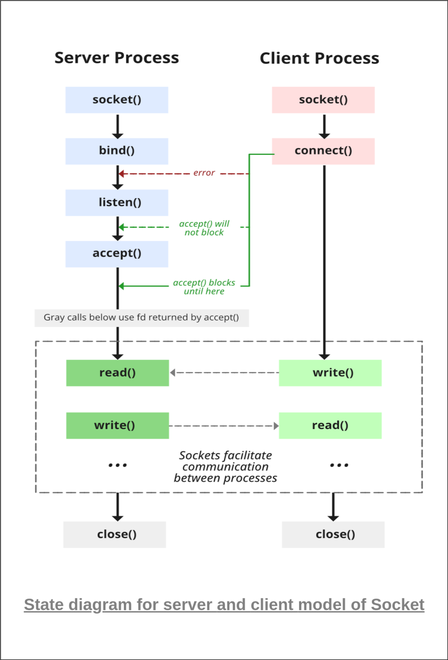

# Truyền gói tin cơ bản
* **Mục tiêu**: Viết được chương trình để gửi và nhận gói tin.
* Dưới đây ta sẽ viết một chương trình đóng vai trò làm server. Server này có thể thiết lập kết nối với duy nhất một client. Sau khi thiết lập kết nối xong, Server sẽ có nhiệm vụ phản hồi lại bất cứ thông tin gì client gửi tới cho đến khi client gửi đi gói tin với nội dung "Quit" thì kết thúc kết nối với client đó.
* VD ở phía Client:
```
Client: Hello
Server: Hello
Client: Tiep12345
Server: Tiep12345
Client: QUIT
Server: QUIT
--- Close the connection ---
```
* Thực hiện yêu cầu trên với 2 loại giao thức **TCP/IP** và **UDP**.

## Thiết lập Socket
**Socket** được thiết kế để một process này có thể nói chuyện với một process khác. Mỗi **socket** sử dụng duy nhất một port riêng biệt để giao tiếp.

### TCP/IP
Ta sẽ bắt đầu từ ví dụ đối với giao thức **TCP** trước. Dưới đây là State Diagram trong việc thiết lập kết nối đối với **TCP**.



Các hàm liên quan tới socket mà ta sử dụng sẽ nằm trong thư viện ```sys/socket.h```

Để tạo socket ta sử dụng hàm sau:
```
socket(domain, type, protocol)
```
* Giải thích:
    * Hàm ```socket()``` sẽ trả về kiểu ```int```. Ta sẽ lưu giá trị trả về này lại và biến dùng để lưu ta tạm gọi là **socket descriptor**. Đây sẽ là giá trị đại diện cho socket vừa tạo.
    * ***domain***: Một số nguyên chỉ định *communication domain*. Một số giá trị phổ biến như
        * ```AF_LOCAL```: Để sử dụng local (tức là bên gửi và bên nhận là 2 process khác nhau trên cùng một host)
        * ```AF_INET```: Dùng để giao tiếp giữa các tiến trình khác nhau trên các host khác nhau kết nối dựa trên *IPv4*.
        * ```AF_INET6```: Tương tự ```AF_INET``` nhưng dùng cho *IPv6*.
    * ***type***: Loại kết nối (*Stream socket* hay *Datagram socket*)
        * ```SOCK_STREAM```: Kết nối loại *Stream socket*, sử dụng giao thức **TCP**.
        * ```SOCK_DGRAM```: Kết nối loại *Datagram socket*, sử dụng giao thức **UDP**.
    * ***protocol***: Giá trị liên quan đến IP, thường để là 0. Những giá trị khác của nó là ```IPPROTO_UDP```, ```IPPROTO_TCP```.
* Ví dụ dưới đây sẽ tạo Socket để có thể kết nối qua địa chỉ IPv4 và sử dụng giao thức **TCP** để giao tiếp:

```C
int sock = socket(AF_INET, SOCK_STREAM, 0);
```

Sau đó ta cần định nghĩa thông tin địa chỉ (address) của **socket** bao gồm domain, IP và số cổng bao nhiêu. 
```C
struct sockaddr_in addr;
addr.sin_family = AF_INET;
addr.sin_port = htons(4866);
addr.sin_addr.s_addr = INADDR_ANY;
```
* Giải thích:
    * ```struct sockaddr_in addr```: Tạo ra một biến với kiểu là một struct sockaddr_in. Đây là một struct được định nghĩa trong thư viện ```netinet/in.h``` có sẵn trên Linux để chứa thông tin liên quan tới địa chỉ socket. Biến này sẽ phục vụ việc kết nối (đối với Client) hoặc gán cho socket (đối với Server). Đối với domain là ```AF_INET6```, ta cần sử dụng ```struct sockaddr_in6```.
    * ```addr.sin_family = AF_INET;```: Tương tự với giải thích về ```AF_INET``` phía trên.
    * ```addr.sin_port = htons(4866);```: Định nghĩa số cổng, ở đây là 4866 (hàm *htons()* để chuyển một biến có kiểu *uint16_t* từ *byte order* sang *network order*).
    * ```addr.sin_addr.s_addr = INADDR_ANY;```: Định nghĩa IP của địa chỉ, trong trường hợp ta muốn đặt là IP máy mình thì ta có thể sử dụng giá trị ```INADDR_ANY``` để làm việc đó.

Sau khi đã tạo socket và xác định thông tin địa chỉ, theo như lý thuyết về giao thức TCP, ta sẽ tiến hành thiết lập kết nối giữa Client và Server.

Đối với bên Server, ta sẽ lần lượt thực hiện các bước *bind()* để gán địa chỉ cho socket mới tạo và *listen()* để bắt đầu quá trình tiếp nhận kết nối mới trên socket đó. Sau đó kết nối mới sẽ được xử lý qua hàm *accept()*.
```C
// Bind socket to address
bind(sock, (struct sockaddr*) &addr, sizeof(addr));

// Start listening
listen(sock, 1);
```
Hàm ***accept()*** sẽ chấp nhận kết nối với Client đứng đầu hàng đợi. Nếu không có Client nào thì hàm sẽ dừng lại cho tới khi có kết nối trừ khi socket ở chế độ *nonblocking* (Ở chế độ này, nếu như hàng đợi không có client nào thì hàm sẽ trả về -1). 
```
int accept(int socket, struct sockaddr *address, int *address_len);
```

Khi vừa có kết nối thì nó sẽ trả về giá trị là socket descriptor mới với tính chất tương tự như tham số ***socket*** được đưa vào, nhưng chỉ dùng để giao tiếp với client chứ không dùng để chấp nhận kết nối mới. Các tham số ***address*** và ***address_len*** liên quan tới địa chỉ client, trong trường hợp không quan tâm tới thì ta có thể để là ```NULL```

```C
accept(sock, NULL, NULL);
```

Còn đối với Client thì sau khi xác định thông tin địa chỉ, Client sẽ tiến hành kết nối tới socket của Server. Ta sẽ lại sử dụng thông tin về địa chỉ của Server để đưa vào tham số của hàm kết nối.
```C
connect(sock, (struct sockaddr*) &serverAddr, sizeof(serverAddr));
```
Hàm trên sẽ trả về -1 nếu kết nối thất bại. Sau khi kết nối thành công, cả hai đã bắt đầu có thể trao đổi thông tin với nhau.

Việc trao đổi thông tin qua socket đối với **TCP** sẽ được thực hiện thông qua 2 hàm chính sau đây:
* ```int recv(int socket, char *buffer, int length, int flags);```: Hàm để nhận dữ liệu
    * ***socket***: Socket descriptor
    * ***buffer***: Con trỏ tới mảng data vừa nhận được
    * ***length***: Độ dài của data vừa nhận được
    * ***flag***: Sử dụng để cài đặt thêm về việc nhận. Nếu muốn sử dụng nhiều flag cùng một lúc thì sử dụng toán tử OR ' | ' (VD ```MSG_CONNTERM | MSG_WAITALL```). Nếu không cần thì để là ```0```.
* ```int send(int socket, char *buffer, int length, int flags);```: Hàm để gửi dữ liệu. Tham số cũng tương tự hàm recv(). ***buffer*** dùng để chứa mảng dữ liệu ta muốn gửi đi và ***length*** là độ dài mảng đó.

### UDP
Việc thiết lập kết nối qua UDP cũng tương tự so với TCP. Duy chỉ khác là về cơ chế hoạt động của UDP là không hướng kết nối, khác so với TCP là hướng kết nối. Vì thế đối với UDP, ta sẽ không có bước thiết lập kết nối như ở trên mà sau khi tạo socket xong và xác định thông tin địa chỉ và gán cho socket xong (ở phía Server), ta có thể tiến hành giao tiếp luôn.

Việc trao đổi thông tin qua socket đối với **UDP** cũng có 2 hàm chính để xử lý gửi và nhận như sau:
* ```int sendto(int socket, char *buffer, int length, int flags, struct sockaddr *address, int address_len);```: Hàm để gửi dữ liệu
    * Các tham số như ***socket***, ***buffer***, ***length*** và ***flag*** tương tự như của hàm **send()**.
    * Tham số ***address*** để trỏ tới struct sockaddr liên quan đến thông tin địa chỉ giống như ở TCP. ***address_len*** là độ dài của thông tin địa chỉ mà tham số ***address*** trở tới.
* ```int recvfrom(int socket, char *buffer, int length, int flags, struct sockaddr *address, int *address_length);```: Hàm để nhận dữ liệu, các tham số tương tự như hàm gửi.


### Reference
* https://www.geeksforgeeks.org/socket-programming-cc/
* https://www.ibm.com/docs/en/zos/2.1.0